Assignment 2: Data visualization with ggplot
============================================

<hr>
<h3>
Instructions: Please read through this before you begin
</h3>

------------------------------------------------------------------------

<ul>
<li>
This assignment is due by <b>10pm on Wednesday 04/08/20</b>. Please
upload it using your personal GitHub repository for this class.

<li>
For this assignment, please <b>reproduce this markdown file exactly as
shown</b> using R markdown.

<li>
Please name your R markdown file `assignment_2.Rmd` and the knitted
markdown file `assignment_2.md`.

<li>
Pay attention to all the formating in this file, including bullet
points, bolded characters, inserted code chunks, headings, text colors,
blank lines, and etc. You will need to reproduce all of these.

<li>
Have all your code embeded within the R markdown file, and show both of
your code and plots in the knitted markdown file.

<li>
When a verbal response is needed, answer by replacing the parts that say
“Write your response here”.

<li>
Use R Markdown functionalities to <b>hide messages and warnings when
needed.</b> (Suggestion: messages and warnings can often be informative
and important, so please examine them carefully and only turn them off
when you finish the exercise).

<li>
You can start by making a copy of the R markdown template that you
created as last week’s assignment and work from there.

<li>
First, load all the required packages with the following code. Install
them if they are not installed yet.

</ul>
<br>

``` r
library(tidyverse)
library(knitr)
```

<br>
<h3>
Exercise 1. Corruption and human development
</h3>
<hr>
This exercise explores a dataset containing the human development index
(`HDI`) and corruption perception index (`CPI`) of 173 countries across
6 different regions around the world: Americas, Asia Pacific, Eastern
Europe and Central Asia (`East EU Cemt`), Western Europe
(`EU W. Europe`), Middle East and North Africa and Noth Africa (`MENA`),
and Sub-Saharan Africa (`SSA`). (Note: the larger `CPI` is, the less
corrupted the country is perceived to be.)

<br> First, we load the data using the following code.

``` r
economist_data <- read_csv("https://raw.githubusercontent.com/nt246/NTRES6940-data-science/master/datasets/EconomistData.csv") # Window users may need to change the slashes in this path
```

<br> **1.1 Show the first few rows of <b>`economist_data`</b>.**

| X1  |      Country|  HDI.Rank|  HDI  | CPI |       Region      |
|:----|------------:|---------:|:-----:|:---:|:-----------------:|
| 1   |  Afghanistan|       172| 0.398 | 1.5 |    Asia Pacific   |
| 2   |      Albania|        70| 0.739 | 3.1 | East EU Cemt Asia |
| 3   |      Algeria|        96| 0.698 | 2.9 |        MENA       |
| 4   |       Angola|       148| 0.486 | 2.0 |        SSA        |
| 5   |    Argentina|        45| 0.797 | 3.0 |      Americas     |
| 6   |      Armenia|        86| 0.716 | 2.6 | East EU Cemt Asia |

<br> **1.2 Expore the relationship between human development index
(<b>`HDI`</b>) and corruption perception index (<b>`CPI`</b>) with a
scatter plot as the following.**

``` r
ggplot(data = economist_data) + geom_point(mapping = aes(x=CPI, y=HDI)) 
```

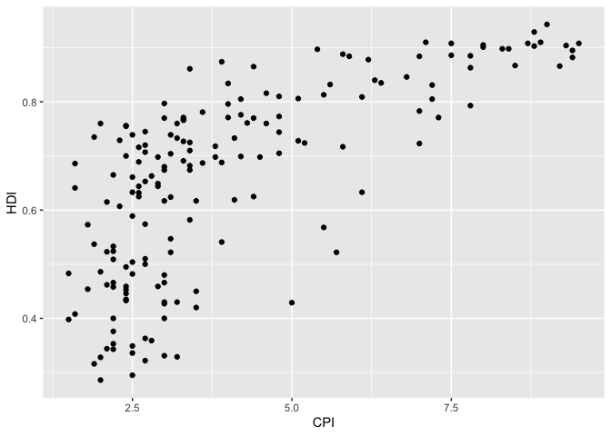

<br> **1.3 Make of color of all points in the previous plot red.**

``` r
ggplot(data = economist_data) + geom_point(mapping = aes(x=CPI, y=HDI), col = "red") 
```

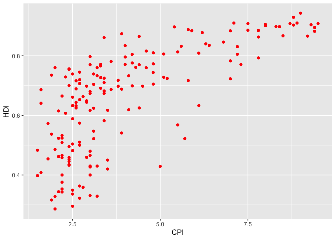

<br> **1.4 Color the points in the previous plot according to the
<b>`Region`</b> variable, and set the size of points to 2.**

``` r
ggplot(data = economist_data) + geom_point(mapping = aes(x=CPI, y=HDI, color=Region), size = 2) 
```

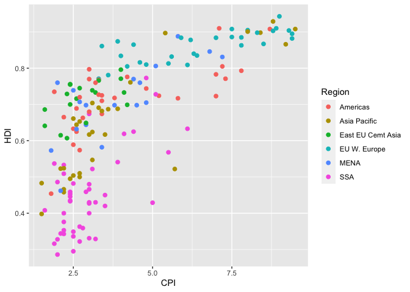

<br> **1.5 Set the size of the points proportional to
<b>`HDI.Rank`</b>**

``` r
ggplot(data = economist_data) + geom_point(mapping = aes(x=CPI, y=HDI, color=Region, size=HDI.Rank)) 
```

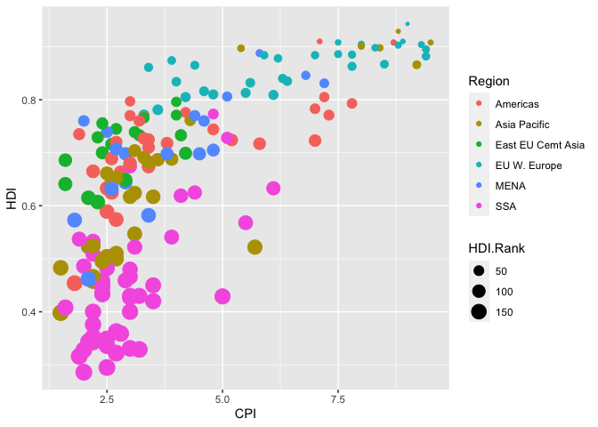

<br> **1.6 Fit a smoothing line to all the data points in the scatter
plot from Excercise 1.4**

``` r
ggplot(data = economist_data) + geom_point(mapping = aes(x=CPI, y=HDI, color=Region)) +   geom_smooth(mapping = aes(x=CPI, y=HDI))
```

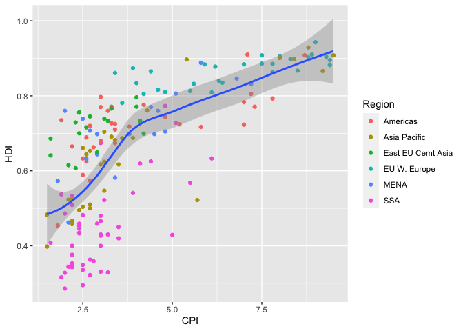

<br> **1.7 Fit a separate straight line for each region instead, and
turn off the confidence interval.**

``` r
ggplot(economist_data, aes(x = CPI, y = HDI, color = Region) ) +
     geom_point() +
     geom_smooth(method = "lm", se = FALSE)
```

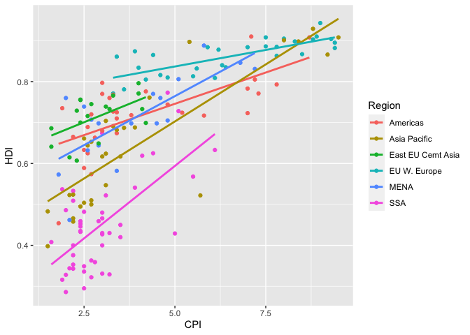

<br> **1.8 Building on top of the previous plot, show each
<b>`Region`</b> in a different facet.**

``` r
ggplot(economist_data, aes(x = CPI, y = HDI, color = Region) ) +
     geom_point() +
     geom_smooth(method = "lm", se = FALSE)+
  facet_wrap(~ Region, nrow = 2)
```

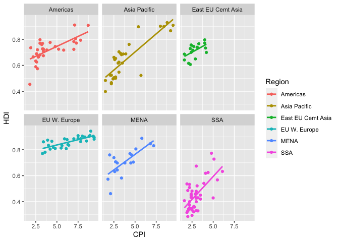

<br> **1.9 Show the distribution of <b>`HDI`</b> in each region using
density plot. Set the transparency to 0.5**

``` r
ggplot(economist_data) +
  geom_density(aes(fill=Region, x=HDI), alpha=0.5)
```

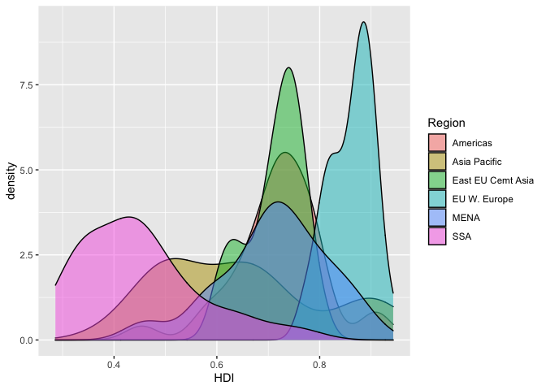

<br> **1.10 Show the distribution of <b>`HDI`</b> in each region using
histogram and facetting.**

``` r
ggplot(economist_data) +
  geom_histogram(aes(x=HDI, color = Region) )+
  facet_wrap(~ Region)
```

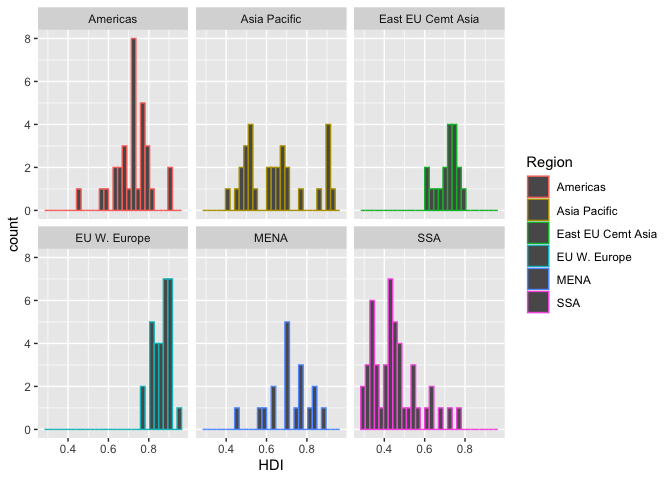

<br> **1.11 Show the distribution of <b>`HDI`</b> in each region using a
box plot. Set the transparency of these boxes to 0.5. Also show data
points for each country in the same plot. (Hint: <b>`geom_jitter()`</b>
or <b>`position_jitter()`</b> might be useful.)**

``` r
ggplot(economist_data, aes(Region, HDI,color=Region)) +
  geom_boxplot(alpha=0.5) +
  geom_jitter()
```

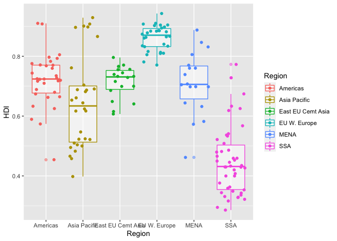

<br> **1.12 Show the count of countries in each region using a bar
plot.**

``` r
ggplot(economist_data) +
  geom_bar(aes(x=Region))
```

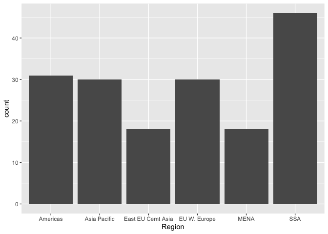

<br> **1.13 You have now created a variety of different plots of the
same dataset. Which of your plots do you think are the most informative?
Describe briefly the major trends that you see in the data.**

Answer: I think the plots in 1.7 and 1.9 can bring me most information
because there are not any facets. Facets always make the comparison
between classes become hard to recogize. Also, the different color and
shape could help me find more relationship among the regions. The major
trends in teh data is becoming more and more clean, visible, and
analyzable. Only having a scatterplot like the plot in 1.1 and 1.2 is
hard for researcher to find differences in multiple explanatory
variables. However, from the following plots, relationships are easy to
find because the strong comparison of color and clear demonstration of
changing trend. <br><br>

<h3>
Exercise 2. Unemployment in the US 1967-2015
</h3>

------------------------------------------------------------------------

This excercise uses the dataset `economics` from the ggplot2 package. It
was produced from US economic time series data available from
<a href="http://research.stlouisfed.org/fred2" class="uri">http://research.stlouisfed.org/fred2</a>.
It descibes the number of unemployed persons (`unemploy`), among other
variables, in the US from 1967 to 2015. <br>

    head(economics) %>% kable()

<br>

| date       |    pce|     pop| psavert | uempmed | unemploy |
|:-----------|------:|-------:|:-------:|:-------:|:--------:|
| 1967-07-01 |  506.7|  198712|   12.6  |   4.5   |   2944   |
| 1967-08-01 |  509.8|  198911|   12.6  |   4.7   |   2945   |
| 1967-09-01 |  515.6|  199113|   11.9  |   4.6   |   2958   |
| 1967-10-01 |  512.2|  199311|   12.9  |   4.9   |   3143   |
| 1967-11-01 |  517.4|  199498|   12.8  |   4.7   |   3066   |
| 1967-12-01 |  525.1|  199657|   11.8  |   4.8   |   3018   |

<br> <br> **2.1 Plot the trend in number of unemploy persons
(<b>`unemployed`</b>) though time using the economics dataset shown
above. And for this question only, hide your code and only show the
plot.**

``` r
ggplot(economics, aes(date, unemploy)) + 
  geom_line() 
```

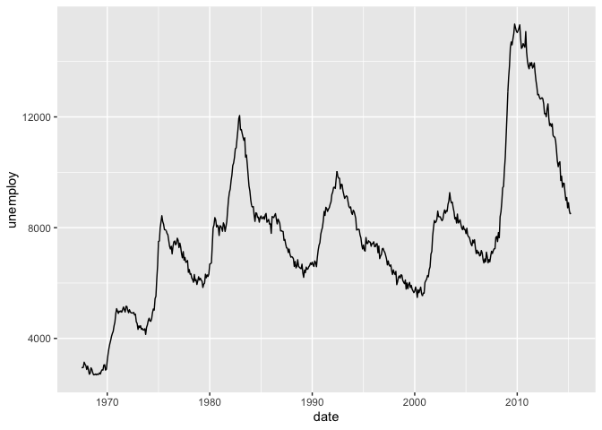

<br>

**2.2 Edit the plot title and axis labels of the previous plot
appropriately. Make y axis start from 0. Change the background theme to
what is shown below. (Hint: search for help online if needed)**

``` r
ggplot(economics, aes(date, unemploy))+
  geom_line()+
  xlab("Year")+
  ylab("Number of unemployed persons (in thousands)")+
  scale_y_continuous(limits = c(0, NA), expand = c(0,0)) 
```

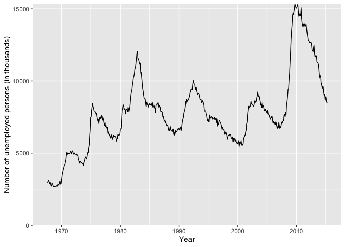
