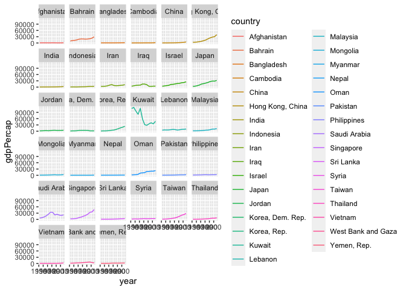

Assignment 3: Data transformation with dplyr
============================================

<h3>
Instructions: Please read through this before you begin
</h3>

------------------------------------------------------------------------

<ul>
<li>
This assignment is due by 10pm on Wednesday 04/15/20.

<li>
For this assignment, please reproduce this markdown file using R
markdown. This includes the followings:

<ul>
<li>
<b>Reproduce this markdown template.</b> Pay attention to all the
formating in this file, including bullet points, bolded characters,
inserted code chunks, headings, text colors, blank lines, and etc.

<li>
<b>Transform the data as instructed.</b> Show the <b>first 6 lines</b>
of the transformed data in a table through RMarkdown <b>using the
kable() function</b>, as shown in this markdown file.

<li>
<b>Reproduce the plots exactly as shown in this html file.</b> In two
cases where the plot is not shown (Excercises 3.7 and 3.9), generate
plots that you think can best answer the question.

<li>
Have all your code embeded within the R markdown file, and show both of
your <b>code</b> and <b>plots</b> in the knitted markdown file.

<li>
When a verbal response is needed, answer by editing the part in the R
markdown template where it says “Write your response here”.

<li>
Use R Markdown functionalities to <b>hide messages and warnings when
needed.</b> (Suggestion: messages and warnings can often be informative
and important, so please examine them carefully and only turn them off
when you finish the exercise).
</ul>
<li>
Please name your R markdown file `assignment_3.Rmd` and the knitted
markdown file `assignment_3.md`. Please upload both files using your
personal GitHub repository for this class.

<li>
First, load all the required packages with the following code. Install
them if they are not installed yet.

</ul>
    library(tidyverse)
    library(knitr)
    library(gapminder)

 
<h3>
Exercise 1. Theophylline experiment
</h3>

This exercise uses the `Theoph` data frame, which has 132 rows and 5
columns of data from an experiment on the pharmacokinetics of
theophylline.

    kable(head(Theoph))

<table>
<thead>
<tr class="header">
<th style="text-align: left;">Subject</th>
<th style="text-align: right;">Wt</th>
<th style="text-align: right;">Dose</th>
<th style="text-align: right;">Time</th>
<th style="text-align: right;">conc</th>
</tr>
</thead>
<tbody>
<tr class="odd">
<td style="text-align: left;">1</td>
<td style="text-align: right;">79.6</td>
<td style="text-align: right;">4.02</td>
<td style="text-align: right;">0.00</td>
<td style="text-align: right;">0.74</td>
</tr>
<tr class="even">
<td style="text-align: left;">1</td>
<td style="text-align: right;">79.6</td>
<td style="text-align: right;">4.02</td>
<td style="text-align: right;">0.25</td>
<td style="text-align: right;">2.84</td>
</tr>
<tr class="odd">
<td style="text-align: left;">1</td>
<td style="text-align: right;">79.6</td>
<td style="text-align: right;">4.02</td>
<td style="text-align: right;">0.57</td>
<td style="text-align: right;">6.57</td>
</tr>
<tr class="even">
<td style="text-align: left;">1</td>
<td style="text-align: right;">79.6</td>
<td style="text-align: right;">4.02</td>
<td style="text-align: right;">1.12</td>
<td style="text-align: right;">10.50</td>
</tr>
<tr class="odd">
<td style="text-align: left;">1</td>
<td style="text-align: right;">79.6</td>
<td style="text-align: right;">4.02</td>
<td style="text-align: right;">2.02</td>
<td style="text-align: right;">9.66</td>
</tr>
<tr class="even">
<td style="text-align: left;">1</td>
<td style="text-align: right;">79.6</td>
<td style="text-align: right;">4.02</td>
<td style="text-align: right;">3.82</td>
<td style="text-align: right;">8.58</td>
</tr>
</tbody>
</table>

**1.1 Select columns that contain a lower case “t” in the `Theoph`
dataset. Do not manually list all the columns to include.**

    kable(head(select(Theoph, contains("t"))))

    kable(head(select(Theoph, Subject, Wt)))

<table>
<thead>
<tr class="header">
<th style="text-align: left;">Subject</th>
<th style="text-align: right;">Wt</th>
</tr>
</thead>
<tbody>
<tr class="odd">
<td style="text-align: left;">1</td>
<td style="text-align: right;">79.6</td>
</tr>
<tr class="even">
<td style="text-align: left;">1</td>
<td style="text-align: right;">79.6</td>
</tr>
<tr class="odd">
<td style="text-align: left;">1</td>
<td style="text-align: right;">79.6</td>
</tr>
<tr class="even">
<td style="text-align: left;">1</td>
<td style="text-align: right;">79.6</td>
</tr>
<tr class="odd">
<td style="text-align: left;">1</td>
<td style="text-align: right;">79.6</td>
</tr>
<tr class="even">
<td style="text-align: left;">1</td>
<td style="text-align: right;">79.6</td>
</tr>
</tbody>
</table>

 

**1.2 Rename the `Wt` column to `Weight` and `conc` column to
`Concentration` in the `Theoph` dataset.**

    kable(rename(Theoph,"Weight" = "Wt","Concentration" = "conc")%>% head())

<table>
<thead>
<tr class="header">
<th style="text-align: left;">Subject</th>
<th style="text-align: right;">Weight</th>
<th style="text-align: right;">Dose</th>
<th style="text-align: right;">Time</th>
<th style="text-align: right;">Concentration</th>
</tr>
</thead>
<tbody>
<tr class="odd">
<td style="text-align: left;">1</td>
<td style="text-align: right;">79.6</td>
<td style="text-align: right;">4.02</td>
<td style="text-align: right;">0.00</td>
<td style="text-align: right;">0.74</td>
</tr>
<tr class="even">
<td style="text-align: left;">1</td>
<td style="text-align: right;">79.6</td>
<td style="text-align: right;">4.02</td>
<td style="text-align: right;">0.25</td>
<td style="text-align: right;">2.84</td>
</tr>
<tr class="odd">
<td style="text-align: left;">1</td>
<td style="text-align: right;">79.6</td>
<td style="text-align: right;">4.02</td>
<td style="text-align: right;">0.57</td>
<td style="text-align: right;">6.57</td>
</tr>
<tr class="even">
<td style="text-align: left;">1</td>
<td style="text-align: right;">79.6</td>
<td style="text-align: right;">4.02</td>
<td style="text-align: right;">1.12</td>
<td style="text-align: right;">10.50</td>
</tr>
<tr class="odd">
<td style="text-align: left;">1</td>
<td style="text-align: right;">79.6</td>
<td style="text-align: right;">4.02</td>
<td style="text-align: right;">2.02</td>
<td style="text-align: right;">9.66</td>
</tr>
<tr class="even">
<td style="text-align: left;">1</td>
<td style="text-align: right;">79.6</td>
<td style="text-align: right;">4.02</td>
<td style="text-align: right;">3.82</td>
<td style="text-align: right;">8.58</td>
</tr>
<tr class="odd">
<td style="text-align: left;"> </td>
<td style="text-align: right;"></td>
<td style="text-align: right;"></td>
<td style="text-align: right;"></td>
<td style="text-align: right;"></td>
</tr>
</tbody>
</table>

**1.3 Extract the `Dose` greater than 4.5 and `Time` greater than the
mean `Time`.**

    summary(Theoph)

    ##     Subject         Wt             Dose            Time             conc       
    ##  6      :11   Min.   :54.60   Min.   :3.100   Min.   : 0.000   Min.   : 0.000  
    ##  7      :11   1st Qu.:63.58   1st Qu.:4.305   1st Qu.: 0.595   1st Qu.: 2.877  
    ##  8      :11   Median :70.50   Median :4.530   Median : 3.530   Median : 5.275  
    ##  11     :11   Mean   :69.58   Mean   :4.626   Mean   : 5.895   Mean   : 4.960  
    ##  3      :11   3rd Qu.:74.42   3rd Qu.:5.037   3rd Qu.: 9.000   3rd Qu.: 7.140  
    ##  2      :11   Max.   :86.40   Max.   :5.860   Max.   :24.650   Max.   :11.400  
    ##  (Other):66

    kable(filter(Theoph, Dose > 4.5, Time > 5.895)%>% head())

<table>
<thead>
<tr class="header">
<th style="text-align: left;">Subject</th>
<th style="text-align: right;">Wt</th>
<th style="text-align: right;">Dose</th>
<th style="text-align: right;">Time</th>
<th style="text-align: right;">conc</th>
</tr>
</thead>
<tbody>
<tr class="odd">
<td style="text-align: left;">3</td>
<td style="text-align: right;">70.5</td>
<td style="text-align: right;">4.53</td>
<td style="text-align: right;">7.07</td>
<td style="text-align: right;">5.30</td>
</tr>
<tr class="even">
<td style="text-align: left;">3</td>
<td style="text-align: right;">70.5</td>
<td style="text-align: right;">4.53</td>
<td style="text-align: right;">9.00</td>
<td style="text-align: right;">4.90</td>
</tr>
<tr class="odd">
<td style="text-align: left;">3</td>
<td style="text-align: right;">70.5</td>
<td style="text-align: right;">4.53</td>
<td style="text-align: right;">12.15</td>
<td style="text-align: right;">3.70</td>
</tr>
<tr class="even">
<td style="text-align: left;">3</td>
<td style="text-align: right;">70.5</td>
<td style="text-align: right;">4.53</td>
<td style="text-align: right;">24.17</td>
<td style="text-align: right;">1.05</td>
</tr>
<tr class="odd">
<td style="text-align: left;">5</td>
<td style="text-align: right;">54.6</td>
<td style="text-align: right;">5.86</td>
<td style="text-align: right;">7.02</td>
<td style="text-align: right;">7.09</td>
</tr>
<tr class="even">
<td style="text-align: left;">5</td>
<td style="text-align: right;">54.6</td>
<td style="text-align: right;">5.86</td>
<td style="text-align: right;">9.10</td>
<td style="text-align: right;">5.90</td>
</tr>
<tr class="odd">
<td style="text-align: left;"> </td>
<td style="text-align: right;"></td>
<td style="text-align: right;"></td>
<td style="text-align: right;"></td>
<td style="text-align: right;"></td>
</tr>
</tbody>
</table>

**1.4 Sort the `Theoph` dataset by `Wt` from smallest to largest and
secondarily by `Time` from largest to smallest.**

    kable(arrange(Theoph, Wt, -Time)%>% head())

<table>
<thead>
<tr class="header">
<th style="text-align: left;">Subject</th>
<th style="text-align: right;">Wt</th>
<th style="text-align: right;">Dose</th>
<th style="text-align: right;">Time</th>
<th style="text-align: right;">conc</th>
</tr>
</thead>
<tbody>
<tr class="odd">
<td style="text-align: left;">5</td>
<td style="text-align: right;">54.6</td>
<td style="text-align: right;">5.86</td>
<td style="text-align: right;">24.35</td>
<td style="text-align: right;">1.57</td>
</tr>
<tr class="even">
<td style="text-align: left;">5</td>
<td style="text-align: right;">54.6</td>
<td style="text-align: right;">5.86</td>
<td style="text-align: right;">12.00</td>
<td style="text-align: right;">4.37</td>
</tr>
<tr class="odd">
<td style="text-align: left;">5</td>
<td style="text-align: right;">54.6</td>
<td style="text-align: right;">5.86</td>
<td style="text-align: right;">9.10</td>
<td style="text-align: right;">5.90</td>
</tr>
<tr class="even">
<td style="text-align: left;">5</td>
<td style="text-align: right;">54.6</td>
<td style="text-align: right;">5.86</td>
<td style="text-align: right;">7.02</td>
<td style="text-align: right;">7.09</td>
</tr>
<tr class="odd">
<td style="text-align: left;">5</td>
<td style="text-align: right;">54.6</td>
<td style="text-align: right;">5.86</td>
<td style="text-align: right;">5.02</td>
<td style="text-align: right;">7.56</td>
</tr>
<tr class="even">
<td style="text-align: left;">5</td>
<td style="text-align: right;">54.6</td>
<td style="text-align: right;">5.86</td>
<td style="text-align: right;">3.50</td>
<td style="text-align: right;">8.74</td>
</tr>
<tr class="odd">
<td style="text-align: left;"> </td>
<td style="text-align: right;"></td>
<td style="text-align: right;"></td>
<td style="text-align: right;"></td>
<td style="text-align: right;"></td>
</tr>
</tbody>
</table>

**1.5 Create a new column called `Quantity` that equals to `Wt` x `Dose`
in the `Theoph` dataset. This will tell you the absolute quantity of
drug administered to the subject (in mg). Replace the `Dose` variable
with `Quantity`.**

    kable(head(select(Theoph %>% mutate(Quantity = Wt * Dose), Subject, Wt, Quantity, Time, conc)))

<table>
<thead>
<tr class="header">
<th style="text-align: left;">Subject</th>
<th style="text-align: right;">Wt</th>
<th style="text-align: right;">Quantity</th>
<th style="text-align: right;">Time</th>
<th style="text-align: right;">conc</th>
</tr>
</thead>
<tbody>
<tr class="odd">
<td style="text-align: left;">1</td>
<td style="text-align: right;">79.6</td>
<td style="text-align: right;">319.992</td>
<td style="text-align: right;">0.00</td>
<td style="text-align: right;">0.74</td>
</tr>
<tr class="even">
<td style="text-align: left;">1</td>
<td style="text-align: right;">79.6</td>
<td style="text-align: right;">319.992</td>
<td style="text-align: right;">0.25</td>
<td style="text-align: right;">2.84</td>
</tr>
<tr class="odd">
<td style="text-align: left;">1</td>
<td style="text-align: right;">79.6</td>
<td style="text-align: right;">319.992</td>
<td style="text-align: right;">0.57</td>
<td style="text-align: right;">6.57</td>
</tr>
<tr class="even">
<td style="text-align: left;">1</td>
<td style="text-align: right;">79.6</td>
<td style="text-align: right;">319.992</td>
<td style="text-align: right;">1.12</td>
<td style="text-align: right;">10.50</td>
</tr>
<tr class="odd">
<td style="text-align: left;">1</td>
<td style="text-align: right;">79.6</td>
<td style="text-align: right;">319.992</td>
<td style="text-align: right;">2.02</td>
<td style="text-align: right;">9.66</td>
</tr>
<tr class="even">
<td style="text-align: left;">1</td>
<td style="text-align: right;">79.6</td>
<td style="text-align: right;">319.992</td>
<td style="text-align: right;">3.82</td>
<td style="text-align: right;">8.58</td>
</tr>
<tr class="odd">
<td style="text-align: left;"> </td>
<td style="text-align: right;"></td>
<td style="text-align: right;"></td>
<td style="text-align: right;"></td>
<td style="text-align: right;"></td>
</tr>
</tbody>
</table>

**1.6 Group the `Theoph` dataset by `Subject` and find the mean `conc`
and sum of `Dose` received by each test subject. Show the 6 lines with
the smallest sum of Dose as below. Do not define new variables for this
exercise and only use pipes.**

    kable(head(select(Theoph %>% mutate(Quantity = Wt * Dose), Subject, Wt, Quantity, Time, conc)))

<table>
<thead>
<tr class="header">
<th style="text-align: left;">Subject</th>
<th style="text-align: right;">Wt</th>
<th style="text-align: right;">Quantity</th>
<th style="text-align: right;">Time</th>
<th style="text-align: right;">conc</th>
</tr>
</thead>
<tbody>
<tr class="odd">
<td style="text-align: left;">1</td>
<td style="text-align: right;">79.6</td>
<td style="text-align: right;">319.992</td>
<td style="text-align: right;">0.00</td>
<td style="text-align: right;">0.74</td>
</tr>
<tr class="even">
<td style="text-align: left;">1</td>
<td style="text-align: right;">79.6</td>
<td style="text-align: right;">319.992</td>
<td style="text-align: right;">0.25</td>
<td style="text-align: right;">2.84</td>
</tr>
<tr class="odd">
<td style="text-align: left;">1</td>
<td style="text-align: right;">79.6</td>
<td style="text-align: right;">319.992</td>
<td style="text-align: right;">0.57</td>
<td style="text-align: right;">6.57</td>
</tr>
<tr class="even">
<td style="text-align: left;">1</td>
<td style="text-align: right;">79.6</td>
<td style="text-align: right;">319.992</td>
<td style="text-align: right;">1.12</td>
<td style="text-align: right;">10.50</td>
</tr>
<tr class="odd">
<td style="text-align: left;">1</td>
<td style="text-align: right;">79.6</td>
<td style="text-align: right;">319.992</td>
<td style="text-align: right;">2.02</td>
<td style="text-align: right;">9.66</td>
</tr>
<tr class="even">
<td style="text-align: left;">1</td>
<td style="text-align: right;">79.6</td>
<td style="text-align: right;">319.992</td>
<td style="text-align: right;">3.82</td>
<td style="text-align: right;">8.58</td>
</tr>
<tr class="odd">
<td style="text-align: left;"> </td>
<td style="text-align: right;"></td>
<td style="text-align: right;"></td>
<td style="text-align: right;"></td>
<td style="text-align: right;"></td>
</tr>
</tbody>
</table>

 
<h3>
Exercise 2. Trend in land value
</h3>

This excercise uses a dataset that describes the trend of land value
(Land.Value), among other variables, in different states in the US
1975-2013. The states are grouped into four different regions, under the
variable region. This dataset was obtained from the Data Science
Services of Harvard University.

    housing <- read_csv("https://raw.githubusercontent.com/nt246/NTRES6940-data-science/master/datasets/landdata_states.csv")

    kable(head(housing))

<table>
<thead>
<tr class="header">
<th style="text-align: left;">State</th>
<th style="text-align: left;">region</th>
<th style="text-align: right;">Date</th>
<th style="text-align: right;">Home.Value</th>
<th style="text-align: right;">Structure.Cost</th>
<th style="text-align: right;">Land.Value</th>
<th style="text-align: right;">Land.Share..Pct.</th>
<th style="text-align: right;">Home.Price.Index</th>
<th style="text-align: right;">Land.Price.Index</th>
<th style="text-align: right;">Year</th>
<th style="text-align: right;">Qrtr</th>
</tr>
</thead>
<tbody>
<tr class="odd">
<td style="text-align: left;">AK</td>
<td style="text-align: left;">West</td>
<td style="text-align: right;">2010.25</td>
<td style="text-align: right;">224952</td>
<td style="text-align: right;">160599</td>
<td style="text-align: right;">64352</td>
<td style="text-align: right;">28.6</td>
<td style="text-align: right;">1.481</td>
<td style="text-align: right;">1.552</td>
<td style="text-align: right;">2010</td>
<td style="text-align: right;">1</td>
</tr>
<tr class="even">
<td style="text-align: left;">AK</td>
<td style="text-align: left;">West</td>
<td style="text-align: right;">2010.50</td>
<td style="text-align: right;">225511</td>
<td style="text-align: right;">160252</td>
<td style="text-align: right;">65259</td>
<td style="text-align: right;">28.9</td>
<td style="text-align: right;">1.484</td>
<td style="text-align: right;">1.576</td>
<td style="text-align: right;">2010</td>
<td style="text-align: right;">2</td>
</tr>
<tr class="odd">
<td style="text-align: left;">AK</td>
<td style="text-align: left;">West</td>
<td style="text-align: right;">2009.75</td>
<td style="text-align: right;">225820</td>
<td style="text-align: right;">163791</td>
<td style="text-align: right;">62029</td>
<td style="text-align: right;">27.5</td>
<td style="text-align: right;">1.486</td>
<td style="text-align: right;">1.494</td>
<td style="text-align: right;">2009</td>
<td style="text-align: right;">3</td>
</tr>
<tr class="even">
<td style="text-align: left;">AK</td>
<td style="text-align: left;">West</td>
<td style="text-align: right;">2010.00</td>
<td style="text-align: right;">224994</td>
<td style="text-align: right;">161787</td>
<td style="text-align: right;">63207</td>
<td style="text-align: right;">28.1</td>
<td style="text-align: right;">1.481</td>
<td style="text-align: right;">1.524</td>
<td style="text-align: right;">2009</td>
<td style="text-align: right;">4</td>
</tr>
<tr class="odd">
<td style="text-align: left;">AK</td>
<td style="text-align: left;">West</td>
<td style="text-align: right;">2008.00</td>
<td style="text-align: right;">234590</td>
<td style="text-align: right;">155400</td>
<td style="text-align: right;">79190</td>
<td style="text-align: right;">33.8</td>
<td style="text-align: right;">1.544</td>
<td style="text-align: right;">1.885</td>
<td style="text-align: right;">2007</td>
<td style="text-align: right;">4</td>
</tr>
<tr class="even">
<td style="text-align: left;">AK</td>
<td style="text-align: left;">West</td>
<td style="text-align: right;">2008.25</td>
<td style="text-align: right;">233714</td>
<td style="text-align: right;">157458</td>
<td style="text-align: right;">76256</td>
<td style="text-align: right;">32.6</td>
<td style="text-align: right;">1.538</td>
<td style="text-align: right;">1.817</td>
<td style="text-align: right;">2008</td>
<td style="text-align: right;">1</td>
</tr>
<tr class="odd">
<td style="text-align: left;"> </td>
<td style="text-align: left;"></td>
<td style="text-align: right;"></td>
<td style="text-align: right;"></td>
<td style="text-align: right;"></td>
<td style="text-align: right;"></td>
<td style="text-align: right;"></td>
<td style="text-align: right;"></td>
<td style="text-align: right;"></td>
<td style="text-align: right;"></td>
<td style="text-align: right;"></td>
</tr>
</tbody>
</table>

**2.1 Washington DC was not assigned to a region in this dataset.
According to the United States Census Bureau, however, DC is part of the
South region. Here:**
<ul>
<li>
**Change the region of DC to “South” (Hint: there are multiple ways to
do this, but mutate() and ifelse() might be helpful)**
<li>
**Save this updated region variable together with State, Date and
Land.Value into a new data frame.**
<li>
**Select the records from DC in this new data frame. How many records
are there from DC? Show its first 6 lines.**
</ul>

Answer: There are about 143 records from DC.

    kable(head(select(mutate(filter(housing, State == "DC"), region = "South"), region, State, Land.Value, Date)))

<table>
<thead>
<tr class="header">
<th style="text-align: left;">region</th>
<th style="text-align: left;">State</th>
<th style="text-align: right;">Land.Value</th>
<th style="text-align: right;">Date</th>
</tr>
</thead>
<tbody>
<tr class="odd">
<td style="text-align: left;">South</td>
<td style="text-align: left;">DC</td>
<td style="text-align: right;">290522</td>
<td style="text-align: right;">2003.00</td>
</tr>
<tr class="even">
<td style="text-align: left;">South</td>
<td style="text-align: left;">DC</td>
<td style="text-align: right;">305673</td>
<td style="text-align: right;">2003.25</td>
</tr>
<tr class="odd">
<td style="text-align: left;">South</td>
<td style="text-align: left;">DC</td>
<td style="text-align: right;">323078</td>
<td style="text-align: right;">2003.50</td>
</tr>
<tr class="even">
<td style="text-align: left;">South</td>
<td style="text-align: left;">DC</td>
<td style="text-align: right;">342010</td>
<td style="text-align: right;">2003.75</td>
</tr>
<tr class="odd">
<td style="text-align: left;">South</td>
<td style="text-align: left;">DC</td>
<td style="text-align: right;">361999</td>
<td style="text-align: right;">2004.00</td>
</tr>
<tr class="even">
<td style="text-align: left;">South</td>
<td style="text-align: left;">DC</td>
<td style="text-align: right;">382792</td>
<td style="text-align: right;">2004.25</td>
</tr>
<tr class="odd">
<td style="text-align: left;"> </td>
<td style="text-align: left;"></td>
<td style="text-align: right;"></td>
<td style="text-align: right;"></td>
</tr>
</tbody>
</table>

**2.2 Generate a dataframe that summarizes the mean land value of each
region at each time point.**

    newdata <- housing %>% 
      group_by(region,Date) %>% 
      summarize(mean_land_value = mean(Land.Value));
    kable(head(newdata))

<table>
<thead>
<tr class="header">
<th style="text-align: left;">region</th>
<th style="text-align: right;">Date</th>
<th style="text-align: right;">mean_land_value</th>
</tr>
</thead>
<tbody>
<tr class="odd">
<td style="text-align: left;">Midwest</td>
<td style="text-align: right;">1975.25</td>
<td style="text-align: right;">2452.167</td>
</tr>
<tr class="even">
<td style="text-align: left;">Midwest</td>
<td style="text-align: right;">1975.50</td>
<td style="text-align: right;">2498.917</td>
</tr>
<tr class="odd">
<td style="text-align: left;">Midwest</td>
<td style="text-align: right;">1975.75</td>
<td style="text-align: right;">2608.167</td>
</tr>
<tr class="even">
<td style="text-align: left;">Midwest</td>
<td style="text-align: right;">1976.00</td>
<td style="text-align: right;">2780.000</td>
</tr>
<tr class="odd">
<td style="text-align: left;">Midwest</td>
<td style="text-align: right;">1976.25</td>
<td style="text-align: right;">2967.333</td>
</tr>
<tr class="even">
<td style="text-align: left;">Midwest</td>
<td style="text-align: right;">1976.50</td>
<td style="text-align: right;">3212.833</td>
</tr>
<tr class="odd">
<td style="text-align: left;"> </td>
<td style="text-align: right;"></td>
<td style="text-align: right;"></td>
</tr>
</tbody>
</table>

**2.3 Using the dataframe above, plot the trend in mean land value of
each region through time.**

    ggplot(newdata, aes(x=Date, y=mean_land_value, color = region)) + 
      geom_line() 

 

 

 
<h3>
Exercise 3. Life expectancy and GDP per capita 1952-2007
</h3>

This exercise uses the `gapminder` dataset from the `gapminder` package.
It describes the life expectancy (`lifeExp`), GDP per capita
(`gdpPercap`), and population (`pop`) of 142 countries from 1952 to
2007. These countries can be grouped into 5 continents. As a reminder,
**reproduce the following plots exactly as shown.**

    kable(head(gapminder))

<table>
<thead>
<tr class="header">
<th style="text-align: left;">country</th>
<th style="text-align: left;">continent</th>
<th style="text-align: right;">year</th>
<th style="text-align: right;">lifeExp</th>
<th style="text-align: right;">pop</th>
<th style="text-align: right;">gdpPercap</th>
</tr>
</thead>
<tbody>
<tr class="odd">
<td style="text-align: left;">Afghanistan</td>
<td style="text-align: left;">Asia</td>
<td style="text-align: right;">1952</td>
<td style="text-align: right;">28.801</td>
<td style="text-align: right;">8425333</td>
<td style="text-align: right;">779.4453</td>
</tr>
<tr class="even">
<td style="text-align: left;">Afghanistan</td>
<td style="text-align: left;">Asia</td>
<td style="text-align: right;">1957</td>
<td style="text-align: right;">30.332</td>
<td style="text-align: right;">9240934</td>
<td style="text-align: right;">820.8530</td>
</tr>
<tr class="odd">
<td style="text-align: left;">Afghanistan</td>
<td style="text-align: left;">Asia</td>
<td style="text-align: right;">1962</td>
<td style="text-align: right;">31.997</td>
<td style="text-align: right;">10267083</td>
<td style="text-align: right;">853.1007</td>
</tr>
<tr class="even">
<td style="text-align: left;">Afghanistan</td>
<td style="text-align: left;">Asia</td>
<td style="text-align: right;">1967</td>
<td style="text-align: right;">34.020</td>
<td style="text-align: right;">11537966</td>
<td style="text-align: right;">836.1971</td>
</tr>
<tr class="odd">
<td style="text-align: left;">Afghanistan</td>
<td style="text-align: left;">Asia</td>
<td style="text-align: right;">1972</td>
<td style="text-align: right;">36.088</td>
<td style="text-align: right;">13079460</td>
<td style="text-align: right;">739.9811</td>
</tr>
<tr class="even">
<td style="text-align: left;">Afghanistan</td>
<td style="text-align: left;">Asia</td>
<td style="text-align: right;">1977</td>
<td style="text-align: right;">38.438</td>
<td style="text-align: right;">14880372</td>
<td style="text-align: right;">786.1134</td>
</tr>
<tr class="odd">
<td style="text-align: left;"> </td>
<td style="text-align: left;"></td>
<td style="text-align: right;"></td>
<td style="text-align: right;"></td>
<td style="text-align: right;"></td>
<td style="text-align: right;"></td>
</tr>
</tbody>
</table>

**3.1 Use a scatterplot to explore the relationship between per capita
GDP (`gdpPercap`) and life expectancy (`lifeExp`).**

    ggplot(data = gapminder) + geom_point(mapping = aes(x=gdpPercap, y=lifeExp)) 

 

**3.2 Add a smoothing line to the previous plot.**

    ggplot(data = gapminder) + geom_point(mapping = aes(x=gdpPercap, y=lifeExp)) +   geom_smooth(mapping = aes(x=gdpPercap, y=lifeExp))

 

**3.3 Show each continent in a different color, and fit a separate
smoothing line to each continent to identify differences in this
relationship between continents. Turn off the confidence intervals.**

    ggplot(data = gapminder) + geom_point(mapping = aes(x=gdpPercap, y=lifeExp, color=continent)) +   geom_smooth( aes(x=gdpPercap, y=lifeExp, color=continent))

    ggplot(data = gapminder) + geom_point(mapping = aes(x=gdpPercap, y=lifeExp, color=continent)) +   geom_smooth( aes(x=gdpPercap, y=lifeExp, color=continent), se = F)

 

**3.4 Use faceting to solve the same problem. Show the confidence
intervals in this plot**

    ggplot(data = gapminder) + geom_point(mapping = aes(x=gdpPercap, y=lifeExp, color=continent)) +   geom_smooth( aes(x=gdpPercap, y=lifeExp, color=continent))+
    facet_wrap(~ continent)

 

**3.5 Explore the trend in life expectancy through time in each
continent. Color by continent.**

    ggplot(data = gapminder, aes(x=year, y=lifeExp, group= country, color=continent))+  geom_line()+
    facet_wrap(~ continent)

 

**3.6 From the previous plot, we see some abnormal trends in Asia and
Africa, where the the life expectancy in some countries sharply dropped
at certain time periods. Here, we look into what happened in Asia in
more detail. First, create a new dataset by filtering only the Asian
countries. Show the first 6 lines of this filtered dataset.**

    asia_data <- filter(gapminder, continent == "Asia")
    kable(head(asia_data))

<table>
<thead>
<tr class="header">
<th style="text-align: left;">country</th>
<th style="text-align: left;">continent</th>
<th style="text-align: right;">year</th>
<th style="text-align: right;">lifeExp</th>
<th style="text-align: right;">pop</th>
<th style="text-align: right;">gdpPercap</th>
</tr>
</thead>
<tbody>
<tr class="odd">
<td style="text-align: left;">Afghanistan</td>
<td style="text-align: left;">Asia</td>
<td style="text-align: right;">1952</td>
<td style="text-align: right;">28.801</td>
<td style="text-align: right;">8425333</td>
<td style="text-align: right;">779.4453</td>
</tr>
<tr class="even">
<td style="text-align: left;">Afghanistan</td>
<td style="text-align: left;">Asia</td>
<td style="text-align: right;">1957</td>
<td style="text-align: right;">30.332</td>
<td style="text-align: right;">9240934</td>
<td style="text-align: right;">820.8530</td>
</tr>
<tr class="odd">
<td style="text-align: left;">Afghanistan</td>
<td style="text-align: left;">Asia</td>
<td style="text-align: right;">1962</td>
<td style="text-align: right;">31.997</td>
<td style="text-align: right;">10267083</td>
<td style="text-align: right;">853.1007</td>
</tr>
<tr class="even">
<td style="text-align: left;">Afghanistan</td>
<td style="text-align: left;">Asia</td>
<td style="text-align: right;">1967</td>
<td style="text-align: right;">34.020</td>
<td style="text-align: right;">11537966</td>
<td style="text-align: right;">836.1971</td>
</tr>
<tr class="odd">
<td style="text-align: left;">Afghanistan</td>
<td style="text-align: left;">Asia</td>
<td style="text-align: right;">1972</td>
<td style="text-align: right;">36.088</td>
<td style="text-align: right;">13079460</td>
<td style="text-align: right;">739.9811</td>
</tr>
<tr class="even">
<td style="text-align: left;">Afghanistan</td>
<td style="text-align: left;">Asia</td>
<td style="text-align: right;">1977</td>
<td style="text-align: right;">38.438</td>
<td style="text-align: right;">14880372</td>
<td style="text-align: right;">786.1134</td>
</tr>
<tr class="odd">
<td style="text-align: left;"> </td>
<td style="text-align: left;"></td>
<td style="text-align: right;"></td>
<td style="text-align: right;"></td>
<td style="text-align: right;"></td>
<td style="text-align: right;"></td>
</tr>
</tbody>
</table>

**3.7 Using the filtered dataset, identify the countries that had
abnormal trends in life expectancy by plotting, and discuss historical
events possibly explaining these trends. (Hint: facet by country)**

    ggplot(data = asia_data, aes(x=year, y=lifeExp, color=country))+  geom_line()

    sorted_asia_data <- arrange(asia_data, lifeExp)
    ggplot(data = sorted_asia_data, aes(x=year, y=lifeExp, color=country))+  geom_line() +
    facet_wrap(~ country)

**Answer: ** Those countries which have experienced abnormal trends in
life expectancy in Asia are likely to be Afghanistan, Banglasdesh,
Cambodia, India, Indo, Myanmar, Nepal, Oman, Saudi Arabia, Vietnam, and
Yeman. It is obvious that most Asian countries have short life
expectance during the 1950s and 1960s since there are a lot of wars
inside Asia during that time. Thus, WWII and the civil wars inside the
countries in Asia is a reasonable explanation for the low life. However,
specifically for the Afghanistan still holding a short life expectancy
by entering 1990s, the reason might be the middle east issues related to
the United States and the oil market.

    cleaned_asia_data <- arrange(filter(asia_data, lifeExp < 42), lifeExp)
    ggplot(data = cleaned_asia_data, aes(x=year, y=lifeExp, color=country))+  geom_line()+  theme(plot.margin = margin(0,3,0,2, "cm"))

 

**3.8 Explore the trend in per capita GDP through time in each
continent.**

    ggplot(data = gapminder, aes(x=year, y=gdpPercap, group= country, color=continent))+  geom_line()+
    facet_wrap(~ continent)

 

**3.9 There is one Asian country that had a very sharp decline in per
capita GDP. With the previously filtered dataset, use a plot to identify
this country and speculate on the historical event underlying this
pattern.**

    asia_gdp <- filter(gapminder, continent == "Asia")
    ggplot(data = asia_gdp, aes(x=year, y=gdpPercap, color= country))+  geom_line();

    ggplot(data = asia_gdp, aes(x=year, y=gdpPercap, color= country))+  geom_line() +
    facet_wrap(~ country)

Answer: The asian country that ad a very sharp decline in their per
captia GDP is Kuwait From the first and second graph, we could find out
the big drop is from some coutry dropping from over 90000 to about
40000. Thus, we compare the two plots and found out the reason for the
drop is that Iraq invaded Kuwait around that time. The wartime economy
and development is expected to be bad, leading to a sharp decline in per
capita GDP.
