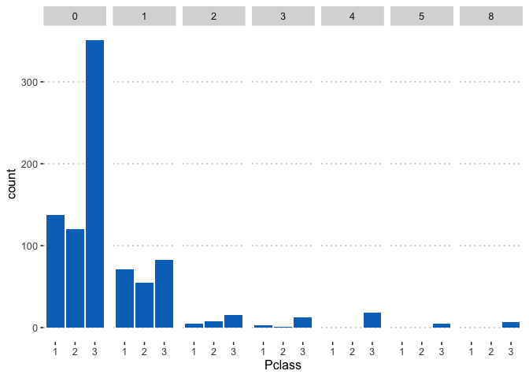
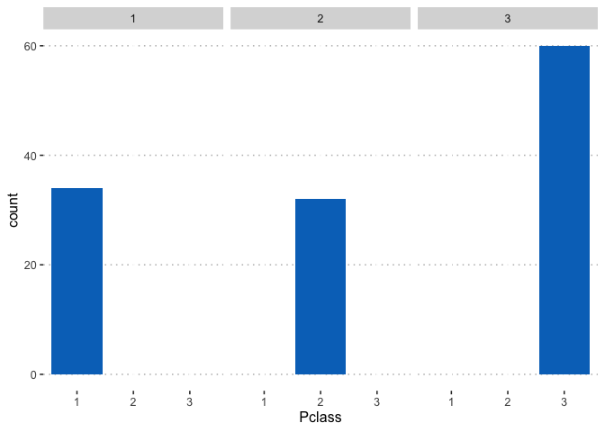

Assignment 4: Data exploration
==============================

<h3>
Instructions: Please read through this before you begin
</h3>

------------------------------------------------------------------------

<ul>
<li>
This assignment is due by 10pm on Wednesday 04/22/20.

<li>
<b>Reproduce this markdown template.</b> Pay attention to all the
formating in this file, including bullet points, bolded characters,
inserted code chunks, headings, text colors, blank lines, and etc.

<li>
For the first exercise in this assignment, you will explore a dataset
with details about passengers on the Titanic. First, <b>answer the
questions below and use figures or tables to support your answer.</b>
Then, <b>explore the dataset on your own</b> using the data
transformation and visualization skills that you have learned in this
class so far.

<ul>
<li>
For this exercise, please make sure to put some thought into <b>editing
the aesthetics of your figures and tables</b> to make them easier to
understand and nicer to look at (e.g. choose the most appropriate
geometric object, aesthetic mapping, facetting, position adjustment; add
meaningful axis labels, figure titles, legend titles; change the
background; be creative; and etc.).

<li>
When a verbal response is needed, answer by replacing the part in the R
markdown template where it says “Write your response here” .
</ul>
<li>
For the second exercise in this assignment, you will use the data
wrangling and visualization skills that you have learned in this class
to reproduce a figure exactly as it is shown.

<li>
Have all your code embedded within the R markdown file, and show both of
your <b>code</b> and <b>plots</b> in the knitted markdown file.

<li>
Use R Markdown functionalities to <b>hide messages and warnings when
needed.</b> (Suggestion: messages and warnings can often be informative
and important, so please examine them carefully and only turn them off
when you finish the exercise).
</ul>
<li>
Please name your R markdown file `assignment_4.Rmd` and the knitted
markdown file `assignment_4.md`. Please upload both files using your
personal GitHub repository for this class.

<li>
First, load all the required packages with the following code. Install
them if they are not installed yet.

</ul>
    library(tidyverse)
    library(knitr)
    library(gapminder)

 
<h3>
Exercise 1: Titanic passengers
</h3>

This dataset contains information about a subset of the passengers who
were aboard the Titanic when it sank in 1912.

    titanic<-read_csv("https://raw.githubusercontent.com/nt246/NTRES6940-data-science/master/datasets/Titanic.csv")
    kable(head(titanic))

<table>
<thead>
<tr class="header">
<th style="text-align: right;">PassengerId</th>
<th style="text-align: right;">Survived</th>
<th style="text-align: right;">Pclass</th>
<th style="text-align: left;">Name</th>
<th style="text-align: left;">Sex</th>
<th style="text-align: right;">Age</th>
<th style="text-align: right;">SibSp</th>
<th style="text-align: right;">Parch</th>
<th style="text-align: left;">Ticket</th>
<th style="text-align: right;">Fare</th>
<th style="text-align: left;">Cabin</th>
<th style="text-align: left;">Embarked</th>
</tr>
</thead>
<tbody>
<tr class="odd">
<td style="text-align: right;">1</td>
<td style="text-align: right;">0</td>
<td style="text-align: right;">3</td>
<td style="text-align: left;">Braund, Mr. Owen Harris</td>
<td style="text-align: left;">male</td>
<td style="text-align: right;">22</td>
<td style="text-align: right;">1</td>
<td style="text-align: right;">0</td>
<td style="text-align: left;">A/5 21171</td>
<td style="text-align: right;">7.2500</td>
<td style="text-align: left;">NA</td>
<td style="text-align: left;">S</td>
</tr>
<tr class="even">
<td style="text-align: right;">2</td>
<td style="text-align: right;">1</td>
<td style="text-align: right;">1</td>
<td style="text-align: left;">Cumings, Mrs. John Bradley (Florence Briggs Thayer)</td>
<td style="text-align: left;">female</td>
<td style="text-align: right;">38</td>
<td style="text-align: right;">1</td>
<td style="text-align: right;">0</td>
<td style="text-align: left;">PC 17599</td>
<td style="text-align: right;">71.2833</td>
<td style="text-align: left;">C85</td>
<td style="text-align: left;">C</td>
</tr>
<tr class="odd">
<td style="text-align: right;">3</td>
<td style="text-align: right;">1</td>
<td style="text-align: right;">3</td>
<td style="text-align: left;">Heikkinen, Miss. Laina</td>
<td style="text-align: left;">female</td>
<td style="text-align: right;">26</td>
<td style="text-align: right;">0</td>
<td style="text-align: right;">0</td>
<td style="text-align: left;">STON/O2. 3101282</td>
<td style="text-align: right;">7.9250</td>
<td style="text-align: left;">NA</td>
<td style="text-align: left;">S</td>
</tr>
<tr class="even">
<td style="text-align: right;">4</td>
<td style="text-align: right;">1</td>
<td style="text-align: right;">1</td>
<td style="text-align: left;">Futrelle, Mrs. Jacques Heath (Lily May Peel)</td>
<td style="text-align: left;">female</td>
<td style="text-align: right;">35</td>
<td style="text-align: right;">1</td>
<td style="text-align: right;">0</td>
<td style="text-align: left;">113803</td>
<td style="text-align: right;">53.1000</td>
<td style="text-align: left;">C123</td>
<td style="text-align: left;">S</td>
</tr>
<tr class="odd">
<td style="text-align: right;">5</td>
<td style="text-align: right;">0</td>
<td style="text-align: right;">3</td>
<td style="text-align: left;">Allen, Mr. William Henry</td>
<td style="text-align: left;">male</td>
<td style="text-align: right;">35</td>
<td style="text-align: right;">0</td>
<td style="text-align: right;">0</td>
<td style="text-align: left;">373450</td>
<td style="text-align: right;">8.0500</td>
<td style="text-align: left;">NA</td>
<td style="text-align: left;">S</td>
</tr>
<tr class="even">
<td style="text-align: right;">6</td>
<td style="text-align: right;">0</td>
<td style="text-align: right;">3</td>
<td style="text-align: left;">Moran, Mr. James</td>
<td style="text-align: left;">male</td>
<td style="text-align: right;">NA</td>
<td style="text-align: right;">0</td>
<td style="text-align: right;">0</td>
<td style="text-align: left;">330877</td>
<td style="text-align: right;">8.4583</td>
<td style="text-align: left;">NA</td>
<td style="text-align: left;">Q</td>
</tr>
</tbody>
</table>

And here are descriptions of the variables in the dataset

    notes<-read_csv("https://raw.githubusercontent.com/nt246/NTRES6940-data-science/master/datasets/Notes.csv")
    kable(notes)

<table>
<thead>
<tr class="header">
<th style="text-align: left;">Variable</th>
<th style="text-align: left;">Definition</th>
<th style="text-align: left;">Key</th>
</tr>
</thead>
<tbody>
<tr class="odd">
<td style="text-align: left;">PassengerId</td>
<td style="text-align: left;">Passenger ID</td>
<td style="text-align: left;">NA</td>
</tr>
<tr class="even">
<td style="text-align: left;">Survival</td>
<td style="text-align: left;">Survival</td>
<td style="text-align: left;">0 = No, 1 = Yes</td>
</tr>
<tr class="odd">
<td style="text-align: left;">Pclass</td>
<td style="text-align: left;">Ticket class</td>
<td style="text-align: left;">1 = 1st, 2 = 2nd, 3 = 3rd</td>
</tr>
<tr class="even">
<td style="text-align: left;">Name</td>
<td style="text-align: left;">Pasenger name</td>
<td style="text-align: left;">NA</td>
</tr>
<tr class="odd">
<td style="text-align: left;">Sex</td>
<td style="text-align: left;">Sex</td>
<td style="text-align: left;">NA</td>
</tr>
<tr class="even">
<td style="text-align: left;">Age</td>
<td style="text-align: left;">Age in years</td>
<td style="text-align: left;">NA</td>
</tr>
<tr class="odd">
<td style="text-align: left;">Sibsp</td>
<td style="text-align: left;"># of siblings / spouses aboard the Titanic</td>
<td style="text-align: left;">NA</td>
</tr>
<tr class="even">
<td style="text-align: left;">Parch</td>
<td style="text-align: left;"># of parents / children aboard the Titanic</td>
<td style="text-align: left;">NA</td>
</tr>
<tr class="odd">
<td style="text-align: left;">Ticket</td>
<td style="text-align: left;">Ticket number</td>
<td style="text-align: left;">NA</td>
</tr>
<tr class="even">
<td style="text-align: left;">Fare</td>
<td style="text-align: left;">Passenger fare</td>
<td style="text-align: left;">NA</td>
</tr>
<tr class="odd">
<td style="text-align: left;">Cabin</td>
<td style="text-align: left;">Cabin number</td>
<td style="text-align: left;">NA</td>
</tr>
<tr class="even">
<td style="text-align: left;">Embarked</td>
<td style="text-align: left;">Port of Embarkation</td>
<td style="text-align: left;">C = Cherbourg, Q = Queenstown, S = Southampton</td>
</tr>
</tbody>
</table>

Note: Age is fractional if less than 1. If the age is estimated, it is
in the form of xx.5

<h4>
Part 1.
</h4>
<b>Answer the questions below</b> and <b>use figures or tables</b> to
support your answer. Choose the most appropriate type of figure or table
for each question.

**1.1 According to Wikipedia, there was an estimated 2,224 passengers
and crew onboard the Titanic when it sank. How many of them do we have
information on in this dataset? How many of them survived and how many
did not? What is the overall survival rate?**

    count(titanic, Survived) %>%
      ggplot(aes(x=Survived, y=n, label=n)) +
      geom_col(aes(fill=n)) +
      geom_label(aes(y=n+1))

Answer: 549 + 342 = 891 passengers on record, so other 2224 - 891 = 1333
people were not on record. 549 passengers were not survived while 342
passengers out of 891 were survived. Then for the rate, we could use a
pie chart to find the survival rate:

    library(dplyr)
    library(ggplot2)
    library(ggmap)
    df <- data.frame(value = c(891, 342, 1333),
      Group = c("Survived", "Not Survived", "No Record"))%>%
    mutate(Group = factor(Group, levels = c("No Record", "Not Survived", "Survived")),
              cumulative = cumsum(value),
              midpoint = cumulative - value / 2,
              label = paste0(Group, " ", round(value / sum(value) * 100, 1), "%"))

    ggplot(df, aes(x = 1, weight = value, fill = Group)) +
       geom_bar(width = 1, position = "stack") +
       coord_polar(theta = "y") +
       geom_text(aes(x = 1.3, y = midpoint, label = label)) +
       theme_nothing()      

Thus, we could see that 34.7% percent of the passengers are survived and
on record, 13.3% of passengers are not survived and on record, and 51.9%
percent of the 2224 passengers are not on the records.    

**1.2 How many passengers on the Titanic were males and how many were
females? What do you find when you break it down by ticket class?**

    library(tidyverse)
    library(cowplot)
    library(knitr)
    library(googlesheets4)
    library(ggwordcloud)
    library(viridis)

    count(titanic, Sex) %>%
      ggplot(aes(x=Sex, y=n, label=n)) +
      geom_col(aes(fill=n)) +
      geom_label(aes(y=n+1))

    count(titanic, Sex, Pclass) %>%
      ggplot(aes(x=Sex, y=n, label=n)) +
      geom_col(aes(fill=Sex)) +
      geom_text(aes(y=n+1)) +
      facet_wrap(~Pclass, nrow = 1) +
      scale_fill_viridis_d() +
      theme_cowplot()

Answer: 577 passengers on the Titanic were males and 314 passengers were
females. From the second graph, we can find that in different classes,
the composition of males and females are different. From the first
class, there are 94 females and 122 males. From the second class, there
are 76 females and 108 males. Finally, from the third class, 347 males
and 144 females.    

**1.3 How many passengers of each sex survived and how many of them did
not? What is the survival rate for passengers of each sex?**

Answer: In men, 468 men on record are not survived and 109 men on
records are survived. The rate of men to survive is 18.9%. <b>Male:</b>

    count(filter(titanic, Sex == "male"), Survived) %>%
      ggplot(aes(x=Survived, y=n, label=n)) +
      geom_col(aes(fill=n)) +
      geom_label(aes(y=n+1))

    df <- data.frame(value = c(109, 468),
      Group = c("Survived", "Not Survived"))%>%
    mutate(Group = factor(Group, levels = c("Not Survived", "Survived")),
              cumulative = cumsum(value),
              midpoint = cumulative - value / 2,
              label = paste0(Group, " ", round(value / sum(value) * 100, 1), "%"))

    ggplot(df, aes(x = 1, weight = value, fill = Group)) +
       geom_bar(width = 1, position = "stack") +
       coord_polar(theta = "y") +
       geom_text(aes(x = 1.3, y = midpoint, label = label)) +
       theme_nothing()

  Answer: In femele, 81 women on record are not survived and 223 men
on records are survived. The rate of men to survive is 72.4%.
<b>Female:</b>

    count(filter(titanic, Sex == "female"), Survived) %>%
      ggplot(aes(x=Survived, y=n, label=n)) +
      geom_col(aes(fill=n)) +
      geom_label(aes(y=n+1))

    df <- data.frame(value = c(233, 89),
      Group = c("Survived", "Not Survived"))%>%
    mutate(Group = factor(Group, levels = c("Not Survived", "Survived")),
              cumulative = cumsum(value),
              midpoint = cumulative - value / 2,
              label = paste0(Group, " ", round(value / sum(value) * 100, 1), "%"))

    ggplot(df, aes(x = 1, weight = value, fill = Group)) +
       geom_bar(width = 1, position = "stack") +
       coord_polar(theta = "y") +
       geom_text(aes(x = 1.3, y = midpoint, label = label)) +
       theme_nothing()

   

**1.4 How many passengers do we have age information for (including
estimated age)? For how many is the age information missing? What is the
age distribution for passengers whose age information is available?**

    sum(is.na(titanic$Age))

    ## [1] 177

Answer: Thus, there are 177 entries about the passengers who we dont
have age information for (including estimated age). Thus, we could get
total entries 891 - 177 = 714. Thus, we have 714 passengers with age
info. And here is the age distribution:

    library(ggpubr)
    theme_set(theme_pubr())

    ggplot(titanic, aes(Age)) +
      geom_bar(fill = "#0073C2FF") +
      theme_pubclean()

   

**1.5 Show the age distribution per ticket class, per sex. What do you
find?**

    ggplot(titanic, aes(Age)) +
      geom_bar(fill = "#0073C2FF") +
      theme_pubclean()+
      facet_wrap(~Sex, nrow = 1)

    ggplot(titanic, aes(Age)) +
      geom_bar(fill = "#0073C2FF") +
      theme_pubclean()+
      facet_wrap(~Pclass, nrow = 1)

Answer: From the top two graphs, we could see that the age distribution
in different genders are similar, which are both having the mean/center
around 20-35 and having a good concentration on that. Then, similar to a
normal distribution, the two ends have fewer data points. Since the
number of males are more than the female’s, thus, the peak of male’s age
distribution is higher. Then, from the age distribution according to
different class, we could see that the for the first class, the mean is
around 40 years old and older. For the second class, the mean left shift
a little to around 30 yr, while for the third class, the mean is shifter
to around 20-25yr.    

**1.6 What is the age distribution of passengers who survived vs. those
who did not? What hypothesis can you come up with when comparing these
two distributions?**

    ggplot(titanic, aes(Age)) +
      geom_bar(fill = "#0073C2FF") +
      theme_pubclean()+
      facet_wrap(~Survived, nrow = 1)

Answer: We could see that for the people who are not survived, we see a
greta population around 20 years old. However, for the survived
passengers, we could see that there is comparatively less obvious
distribution trend. Thus, I assume that during that night, the officers
asked the young and the elders to come to the small boat first and then
fill with 20-40 yr adults.

   

**1.7 In this dataset, the Fare variable does not represent the fare per
person. Instead, each ticket number has a corresponding fare, and some
passengers share one single ticket number. Therefore, the Fare variable
is the total fare for a group of passengers sharing the same ticket
number. Knowing this, calculate the average fare per person. (You don’t
need to show a table or a figure for this question, just show the code
for the calculation)**

    ggplot(titanic, aes(Age)) +
      geom_bar(fill = "#0073C2FF") +
      theme_pubclean()+
      facet_wrap(~Survived, nrow = 1)

Answer: We could see that for the people who are not survived, we see a
greta population around 20 years old. However, for the survived
passengers, we could see that there is comparatively less obvious
distribution trend. Thus, I assume that during that night, the officers
asked the young and the elders to come to the small boat first and then
fill with 20-40 yr adults.

   

**1.8 Show the distribution of the number of family members (including
siblings, spouses, parents, and children) that each passenger was
accompanied by. Were most passengers travelling solo or with family?**

    #mutate(titanic$Sibsp = titanic$Sibsp + titanic$Parch);
    ggplot(titanic %>% mutate(SibSp = SibSp + Parch) , aes(titanic$SibSp)) +
      geom_bar(fill = "#0073C2FF") +
      theme_pubclean()

Answer: We could see from the distribution, most of the passengers are
travelling solo.

   

**1.9 Which ticket class did most of the largest families get? And which
ticket class has the lowest proportion of female passengers who
travelled solo out of all the female passengers in that class?**

    ggplot(titanic , aes(Pclass)) +
      geom_bar(fill = "#0073C2FF") +
      theme_pubclean()+
      facet_wrap(~SibSp, nrow = 1)

    ggplot(filter(filter(filter(titanic,  Sex == "female"), SibSp == 0), Parch == 0), aes(Pclass)) +
      geom_bar(fill = "#0073C2FF") +
      theme_pubclean()+
      facet_wrap(~Pclass, nrow = 1)

Answer: From the graph, we could see that the largest families were
likely to get the third class tickets. Then, from the second graph, we
could see that the second class has lowest proportion of female
passengers who travelled solo out of all the female passengers in that
class.    

**1.10 Do the port of embarkation matter for the survival rates of
passengers? Why might this be the case?**

    p<- ggplot(data = titanic, aes(x=Embarked, y=Survived, color=Embarked))
    p + geom_jitter(alpha=0.3) 

Answer: Thus, from the six different setts, we could see that there is
not a strong relationship between the survival rate and the embarkation
matter according to the arrangements of data points. Most of the cases
roughly have a half-and-half survival rate. I think the embarkation port
has nothing affecting to the survival rate since the titanic was down
during its trip in the Atlantic ocean.

   

<h4>
Part 2.
</h4>
Explore other aspects of this dataset on your own using <b>a variety of
the skills</b> that you have learned in this class so far (i.e. data
visualization, transformation, and exploration). Come up with <b>at
least 3 interesting findings or potential hypotheses.</b>

**1.11 Do all the first class tickets have the same price? Do all the
second class tickets have the same price? Do all the third class tickets
have the same price?**

    ggplot(data = titanic) + geom_point(mapping = aes(x=Pclass, y=Fare, color = Pclass))

Answer: We could see the answer is no. The variance is pretty big.

   

**1.12 Do the ticket price matter for the survival rates of passengers?
Use statistical analysis to exaplain why might this be the case?**

    ggplot(data = titanic) + 
    geom_point(mapping = aes(x=Survived, y=Fare, color = Pclass))

    project = lm(data = titanic, Survived ~ Fare)
    summary(project)

    ## 
    ## Call:
    ## lm(formula = Survived ~ Fare, data = titanic)
    ## 
    ## Residuals:
    ##     Min      1Q  Median      3Q     Max 
    ## -0.9653 -0.3391 -0.3222  0.6044  0.6973 
    ## 
    ## Coefficients:
    ##              Estimate Std. Error t value Pr(>|t|)    
    ## (Intercept) 0.3026994  0.0187849  16.114  < 2e-16 ***
    ## Fare        0.0025195  0.0003174   7.939 6.12e-15 ***
    ## ---
    ## Signif. codes:  0 '***' 0.001 '**' 0.01 '*' 0.05 '.' 0.1 ' ' 1
    ## 
    ## Residual standard error: 0.4705 on 889 degrees of freedom
    ## Multiple R-squared:  0.06621,    Adjusted R-squared:  0.06516 
    ## F-statistic: 63.03 on 1 and 889 DF,  p-value: 6.12e-15

Answer: We could see that there is not a strong relationship between the
ticket price and the survival rate. The multiple R-squared is 0.066
which is pretty small, thus there is not a good reasoning for the
relationship. But we could see that the one who bought the most
expensive ticket got survived.

   

**1.13 What percentage of passengers without any sibling spouses,
parents, and children get survived?**

    count(filter(titanic, SibSp == 0), Survived) %>%
      ggplot(aes(x=Survived, y=n, label=n)) +
      geom_col(aes(fill=n)) +
      geom_label(aes(y=n+1))

    df <- data.frame(value = c(210, 398),
      Group = c("Survived", "Not Survived"))%>%
    mutate(Group = factor(Group, levels = c("Not Survived", "Survived")),
              cumulative = cumsum(value),
              midpoint = cumulative - value / 2,
              label = paste0(Group, " ", round(value / sum(value) * 100, 1), "%"))

    ggplot(df, aes(x = 1, weight = value, fill = Group)) +
       geom_bar(width = 1, position = "stack") +
       coord_polar(theta = "y") +
       geom_text(aes(x = 1.3, y = midpoint, label = label)) +
       theme_nothing()   

Answer: From this, we could see that there are 210 solo passengers who
get survived and 398 solo passengers not getting survived. The rate of
the survival for the solo passengers is around 34.5%.

   

<b>Don’t hesitate to continue writing if you have more than 3
interesting findings.</b>

<h3>
Exercise 2. Fuel Efficiency of Car Models
</h3>

This exercise uses the mtcars dataset. It was extracted from the 1974
Motor Trend US magazine, and comprises fuel consumption and 10 aspects
of automobile design and performance for 32 automobiles (1973–74
models).

    kable(head(mtcars)) 

<table>
<thead>
<tr class="header">
<th></th>
<th style="text-align: right;">mpg</th>
<th style="text-align: right;">cyl</th>
<th style="text-align: right;">disp</th>
<th style="text-align: right;">hp</th>
<th style="text-align: right;">drat</th>
<th style="text-align: right;">wt</th>
<th style="text-align: right;">qsec</th>
<th style="text-align: right;">vs</th>
<th style="text-align: right;">am</th>
<th style="text-align: right;">gear</th>
<th style="text-align: right;">carb</th>
</tr>
</thead>
<tbody>
<tr class="odd">
<td>Mazda RX4</td>
<td style="text-align: right;">21.0</td>
<td style="text-align: right;">6</td>
<td style="text-align: right;">160</td>
<td style="text-align: right;">110</td>
<td style="text-align: right;">3.90</td>
<td style="text-align: right;">2.620</td>
<td style="text-align: right;">16.46</td>
<td style="text-align: right;">0</td>
<td style="text-align: right;">1</td>
<td style="text-align: right;">4</td>
<td style="text-align: right;">4</td>
</tr>
<tr class="even">
<td>Mazda RX4 Wag</td>
<td style="text-align: right;">21.0</td>
<td style="text-align: right;">6</td>
<td style="text-align: right;">160</td>
<td style="text-align: right;">110</td>
<td style="text-align: right;">3.90</td>
<td style="text-align: right;">2.875</td>
<td style="text-align: right;">17.02</td>
<td style="text-align: right;">0</td>
<td style="text-align: right;">1</td>
<td style="text-align: right;">4</td>
<td style="text-align: right;">4</td>
</tr>
<tr class="odd">
<td>Datsun 710</td>
<td style="text-align: right;">22.8</td>
<td style="text-align: right;">4</td>
<td style="text-align: right;">108</td>
<td style="text-align: right;">93</td>
<td style="text-align: right;">3.85</td>
<td style="text-align: right;">2.320</td>
<td style="text-align: right;">18.61</td>
<td style="text-align: right;">1</td>
<td style="text-align: right;">1</td>
<td style="text-align: right;">4</td>
<td style="text-align: right;">1</td>
</tr>
<tr class="even">
<td>Hornet 4 Drive</td>
<td style="text-align: right;">21.4</td>
<td style="text-align: right;">6</td>
<td style="text-align: right;">258</td>
<td style="text-align: right;">110</td>
<td style="text-align: right;">3.08</td>
<td style="text-align: right;">3.215</td>
<td style="text-align: right;">19.44</td>
<td style="text-align: right;">1</td>
<td style="text-align: right;">0</td>
<td style="text-align: right;">3</td>
<td style="text-align: right;">1</td>
</tr>
<tr class="odd">
<td>Hornet Sportabout</td>
<td style="text-align: right;">18.7</td>
<td style="text-align: right;">8</td>
<td style="text-align: right;">360</td>
<td style="text-align: right;">175</td>
<td style="text-align: right;">3.15</td>
<td style="text-align: right;">3.440</td>
<td style="text-align: right;">17.02</td>
<td style="text-align: right;">0</td>
<td style="text-align: right;">0</td>
<td style="text-align: right;">3</td>
<td style="text-align: right;">2</td>
</tr>
<tr class="even">
<td>Valiant</td>
<td style="text-align: right;">18.1</td>
<td style="text-align: right;">6</td>
<td style="text-align: right;">225</td>
<td style="text-align: right;">105</td>
<td style="text-align: right;">2.76</td>
<td style="text-align: right;">3.460</td>
<td style="text-align: right;">20.22</td>
<td style="text-align: right;">1</td>
<td style="text-align: right;">0</td>
<td style="text-align: right;">3</td>
<td style="text-align: right;">1</td>
</tr>
</tbody>
</table>

**2.1 Reproduce the following plot, which shows the miles per gallon
(mpg) of car models on the x axis (see hints below). Different models
are ordered on the y axis according to their mpg and their names are
shown next to the data points. Also, the size of each data point maps to
its horse power (hp), and the color maps to number of cylinders (cyl).**

    df <- as.data.frame(mtcars)
    df$ID <- rownames(mtcars)
    #new_mtcars <- rownames_to_column(mtcars, var = "models")
    #new_mtcars <- select(mtcars, models)
    #rename(mtcars,"rowname" = )
    ggplot(data = df) + geom_point(mapping = aes(x=mpg, y=ID, color=cyl, size=hp)) 

Answer:

   

<b>Hint 1: Start by transforming the data frame into the following
format.</b>
<ul>
<li>
Convert rownames to a column. (rownames\_to\_column() might be helpful)
<li>
Create a new variable which shows the order of car models based on their
mpg. (row\_number() might be helpful)
</ul>
The first few rows of this new data frame might look like the following.

rowname mpg mpg\_order cyl hp Mazda RX4 21.0 19 6 110 Mazda RX4 Wag 21.0
20 6 110 Datsun 710 22.8 24 4 93 Hornet 4 Drive 21.4 21 6 110 Hornet
Sportabout 18.7 15 8 175 Valiant 18.1 14 6 105

<b>Hint 2: When making the plot, please pay attention to the following
elements of the plot that need to be specified.
<ul>
<li>
Horizontal adjustment of the text labels (“hjust” option in
geom\_text())</b>
<li>
The range of the x-axis (xlim())
<li>
x-axis label and legend titles (labs())
<li>
Background
<li>
The removal of the y-axis (theme())
