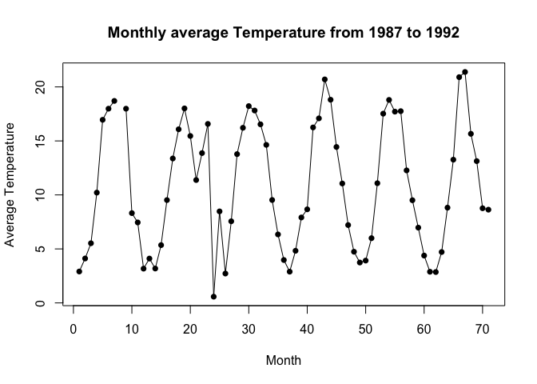
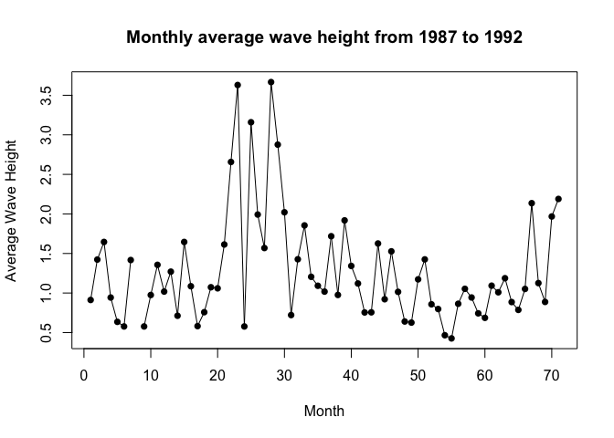

Assignment 6: Iteration and conditional execution
=================================================

<h3>
Instructions: Please read through this before you begin
</h3>

------------------------------------------------------------------------

<ul>
<li>
This assignment is due by 10pm on Wednesday 05/06/20.

<li>
<b>Reproduce this markdown template.</b> Pay attention to all the
formating in this file, including bullet points, bolded characters,
inserted code chunks, headings, text colors, blank lines, and etc.

<li>
The goal of this homework is to review <b>iteration</b> and
<b>conditional execution</b> that we have recently learned and further
explore their utilities in data science.

<li>
Please note that the entire exercise 2 and question 3.5 are
<b>optional</b>.

<li>
Please <b>print the vectors, strings, and plots as shown in this
markdown file</b>. Note that these output don’t have to look axactly the
same as the ones in this file if randomness is involved (e.g. in the
MCMC exercise).

<li>
When a verbal response is needed, answer by editing the part in the R
markdown template where it says “Write your response here” .

<li>
Have all of your code embedded within the R markdown file, and show both
of your <b>code and plots</b> in the knitted markdown file.

<li>
Use R Markdown functionalities to <b>hide messages and warnings when
needed</b>. (Suggestion: messages and warnings can often be informative
and important, so please examine them carefully and only turn them off
when you finish the exercise).

<li>
Please name your R markdown file `assignment_6.Rmd` and the knitted
markdown file `assignment_6.md`. Please upload both files using your
personal GitHub repository for this class.

<li>
To start, first load all the required packages with the following code.
Install them if they are not installed yet.

</ul>
    library(tidyverse)

 
<h3>
Exercise 1: Body mass estimation using vectorization vs. for loop
</h3>

There are two major types of approaches to perform multiple operations
in R: vectorization and for loop. As a simple example, to calculate the
sum of two vectors, `x` and `y`, the syntax for vectorization is simply
`z <- x + y`. With this, the computer will be able to perform the same
operation to each element of x and y vector <b>simultaneously</b>.

The for loop approach, on the other hand, takes the following form:

In this case, the computer loops through each element of x and y and
performs the operation <b>sequentially</b>, resulting in a significantly
longer runtime. Let’s now try to quantify this difference in runtime in
this exercise.

  **1.1** The length of an organism is typically strongly correlated
with its body mass. This is useful because it allows us to estimate the
mass of an organism even if we only know its length. This relationship
generally takes the form: `mass = a * length ^ b`, where the parameters
`a` and `b` vary among groups. This allometric approach is regularly
used to estimate the mass of dinosaurs since we cannot weigh something
that is only preserved as bones.

Spinosaurus is a predator that is bigger, and therefore, by definition,
cooler, than that stupid Tyrannosaurus that everyone likes so much. It
has an estimated `a` of `0.73` and `b` of `3.63`. What is the estimated
mass of a Spinosaurus that is `16` m long based on its reassembled
skeleton?

    a = 0.73;
    b = 3.63;
    length = 16;
    mass = a ;
    for (i in 1.00 : 3.63){
      mass = mass * length;
    }
    mass = mass * length ^ 0.63;
    mass

    ## [1] 17150.56

 

**1.2** The following vectors contain the `lengths` of 40 dinosaurs and
their respective `a` and `b` values. Estimate their `mass` first using a
vectorization approach and then using a for loop approach.

    dinosaur_lengths <- c(17.8013631070471, 20.3764452071665, 14.0743486294308, 25.65782386974, 26.0952008049675, 20.3111541103134, 17.5663244372533, 11.2563431277577, 20.081903202614, 18.6071626441984, 18.0991894513166, 23.0659685685892, 20.5798853467837, 25.6179254233558, 24.3714331573996, 26.2847248252537, 25.4753783544473, 20.4642089867304, 16.0738256364701, 20.3494171706583, 19.854399305869, 17.7889814608919, 14.8016421998303, 19.6840911485379, 19.4685885050906, 24.4807784966691, 13.3359960054899, 21.5065994598917, 18.4640304608411, 19.5861532398676, 27.084751999756, 18.9609366301798, 22.4829168046521, 11.7325716149514, 18.3758846100456, 15.537504851634, 13.4848751773738, 7.68561192214935, 25.5963348603783, 16.588285389794)

    a_values <- c(0.759, 0.751, 0.74, 0.746, 0.759, 0.751, 0.749, 0.751, 0.738, 0.768, 0.736, 0.749, 0.746, 0.744, 0.749, 0.751, 0.744, 0.754, 0.774, 0.751, 0.763, 0.749, 0.741, 0.754, 0.746, 0.755, 0.764, 0.758, 0.76, 0.748, 0.745, 0.756, 0.739, 0.733, 0.757, 0.747, 0.741, 0.752, 0.752, 0.748)

    b_values <- c(3.627, 3.633, 3.626, 3.633, 3.627, 3.629, 3.632, 3.628, 3.633, 3.627, 3.621, 3.63, 3.631, 3.632, 3.628, 3.626, 3.639, 3.626, 3.635, 3.629, 3.642, 3.632, 3.633, 3.629, 3.62, 3.619, 3.638, 3.627, 3.621, 3.628, 3.628, 3.635, 3.624, 3.621, 3.621, 3.632, 3.627, 3.624, 3.634, 3.621)

<ul>
<li>
vectorization:
</ul>
    a_values[] * (dinosaur_lengths[] ^ b_values[] );

    ##  [1]  26039.686  42825.603  10800.224  98273.049 104257.481  41822.386
    ##  [7]  24840.644   4899.022  39915.948  30937.922  26354.908  66384.865
    ## [13]  43837.944  97141.451  80553.856 105556.405  97374.660  42760.136
    ## [19]  18749.274  42109.012  40674.182  26003.425  13229.824  37472.789
    ## [25]  34684.033  80187.272   9460.977  51630.571  29253.772  36399.306
    ## [31] 117511.962  33384.288  58581.226   5462.316  28637.745  15864.172
    ## [37]   9284.810   1218.755  98522.609  19534.524

Hint: If you are unsure about what this means, check out the results
that the following lines return.

    c(1, 2, 3) + c(4, 5, 6)

    ## [1] 5 7 9

    c(1, 2, 3) * c(4, 5, 6)

    ## [1]  4 10 18

<ul>
<li>
for loop:
</ul>
    mass[i]

    ## [1] NA

    for (i in 1:length(dinosaur_lengths)){
      mass[i] = a_values[i] * (dinosaur_lengths[i] ^ b_values[i] );
    }
    mass[]

    ##  [1]  26039.686  42825.603  10800.224  98273.049 104257.481  41822.386
    ##  [7]  24840.644   4899.022  39915.948  30937.922  26354.908  66384.865
    ## [13]  43837.944  97141.451  80553.856 105556.405  97374.660  42760.136
    ## [19]  18749.274  42109.012  40674.182  26003.425  13229.824  37472.789
    ## [25]  34684.033  80187.272   9460.977  51630.571  29253.772  36399.306
    ## [31] 117511.962  33384.288  58581.226   5462.316  28637.745  15864.172
    ## [37]   9284.810   1218.755  98522.609  19534.524

  **1.3** The function `system.time()` can be used to record the
runtime of an operation. For example, `system.time(rnorm(100000))` can
give you the time to draw 100000 samples from a normal distribution.
Here, use `system.time()` to record the runtime of the vectorization
approach and the for loop approach in the previous question.

<ul>
<li>
vertorization:
</ul>
    system.time(
      a_values[] * (dinosaur_lengths[] ^ b_values[] )
      );

    ##    user  system elapsed 
    ##       0       0       0

<ul>
<li>
for loop:
</ul>
    system.time(
    for (i in 1:length(dinosaur_lengths)){
      mass[i] = a_values[i] * (dinosaur_lengths[i] ^ b_values[i] );
    }
    );

    ##    user  system elapsed 
    ##   0.004   0.000   0.004

Although the for loop in this exercise can be run very quickly, it is
noticeably slower than the vectorization approach. With more complicated
operations, vectorization can often shorten the runtime of a for loop
from days to minutes.

 
<h3>
Exercise 2 (Optional): Infinite monkey theorem and Markov Chain Monte
Carlo simulation
</h3>

 
<h3>
Exercise 3: Data inputting and wrangling in batch
</h3>

Another instance where loops are useful is data input / output in batch.
We’ve learned how to make plots and output them in batch in class, so in
this exercise, you will use for loops to automate the inputting and
wrangling process of a group of datasets with similar names and formats
in the
<a href="https://github.com/nt246/NTRES6940-data-science/tree/master/datasets/buoydata" class="uri">https://github.com/nt246/NTRES6940-data-science/tree/master/datasets/buoydata</a>.

**3.1 Given the following code chunk for reading buoy data files from
buoy 44013 for each year, describe the following:**

<ul>
<li>
What parts of your code are consistent across every line/code chunk?
<li>
What parts are different?
</ul>
    buoy_1987 <- read_csv('https://raw.githubusercontent.com/nt246/NTRES6940-data-science/master/datasets/buoydata/44013_1987.csv', na = c("99", "999", "99.00", "999.0"))
    buoy_1988 <- read_csv('https://raw.githubusercontent.com/nt246/NTRES6940-data-science/master/datasets/buoydata/44013_1988.csv', na = c("99", "999", "99.00", "999.0"))
    buoy_1989 <- read_csv('https://raw.githubusercontent.com/nt246/NTRES6940-data-science/master/datasets/buoydata/44013_1989.csv', na = c("99", "999", "99.00", "999.0"))
    buoy_1990 <- read_csv('https://raw.githubusercontent.com/nt246/NTRES6940-data-science/master/datasets/buoydata/44013_1990.csv', na = c("99", "999", "99.00", "999.0"))

Answer: The code are consistent in the " &lt;- read\_csv “, na =
c(”99“,”999“,”99.00“,”999.0“))” part. They are different in the year
number: storing in different project and opening different csv file.

  **3.2 Complete the skeleton of the for loop below, which uses the
str\_c() function to print out the path to the buoy 44013 data file from
year start to end**

    start <- 1987
    end <- 1992
    for (year in start:end){
      path <- str_c("https://raw.githubusercontent.com/nt246/NTRES6940-data-science/master/datasets/buoydata/44013_", year,".csv")
      print(path)
    }

    ## [1] "https://raw.githubusercontent.com/nt246/NTRES6940-data-science/master/datasets/buoydata/44013_1987.csv"
    ## [1] "https://raw.githubusercontent.com/nt246/NTRES6940-data-science/master/datasets/buoydata/44013_1988.csv"
    ## [1] "https://raw.githubusercontent.com/nt246/NTRES6940-data-science/master/datasets/buoydata/44013_1989.csv"
    ## [1] "https://raw.githubusercontent.com/nt246/NTRES6940-data-science/master/datasets/buoydata/44013_1990.csv"
    ## [1] "https://raw.githubusercontent.com/nt246/NTRES6940-data-science/master/datasets/buoydata/44013_1991.csv"
    ## [1] "https://raw.githubusercontent.com/nt246/NTRES6940-data-science/master/datasets/buoydata/44013_1992.csv"

 

**3.3 Complete the skeleton of the for loop below, which reads the buoy
44013 data file from year start to end and combine them together**

    start <- 1987
    end <- 1992
    for (year in start:end){
      path <- str_c("https://raw.githubusercontent.com/nt246/NTRES6940-data-science/master/datasets/buoydata/44013_", year,".csv")
      df <- read_csv(path)
      if (year == start){
        df_combined <- df 
      } else {
        df_combined <- rbind(df_combined, df)
      }
    }
    dim(df_combined)

    ## [1] 49775    16

Here is the dimension of the combined data frame with `start = 1987` and
`end = 1992`:

    ## [1] 49775    16

**3.4 Building on the workflow that you used in 3.1 - 3.3, use a for
loop to read in, clean up, and summarize the buoy data from all years
from 1987 to 1992 using a dplyr workflow.**

Select only the columns `YY` (year), `MM` (month), `WVHT` (wave
heights), `WTMP` (temperatures) and <b>rename</b> these columns to
something understandable. <b>Summarize</b> monthly averaged wave heights
and temperatures throughout the years in a tibble, and <b>plot the
variation of these monthly averaged values through time</b> as shown
below.

There are multiple ways to do this, and for this exercise, you may well
combine all the raw data in a for loop and clean it up after the loop.
In the next (<b>ptional</b>) exercise, however, you will need to clean
up the data in the loop before you can combine them.

    selected_df <- select(df_combined, YY, MM, WVHT, WTMP)
    rename_df <- rename(selected_df, c("Year" = "YY"), c("Month" = "MM"), c("WaveHeights" = "WVHT"), c("Temperatures" = "WTMP"))

    aveWH <- array() 
    aveTemp <- array()
    indexx <- array()

    count = 0
    sum = 0
    tempsum = 0
    index = 0
    for( yr in 87:92 ){
      for ( mo in 1:12){
        
         for( n in 1:49775 ){
            if (rename_df$Year[n] == yr && rename_df$Month[n] == mo){
              sum = sum + rename_df$WaveHeights[n]
              tempsum = tempsum + rename_df$Temperatures[n]
              count = count + 1
            }
         }
          aveWH[index] = sum / count
          aveTemp[index] = tempsum/count
          indexx[index] = index
          index = index + 1
          count = 0
          sum = 0
          tempsum = 0
      }
    }
           aveWH[9] = aveWH[6]
           aveWH[24] = aveWH[6]
          aveTemp[9] = aveTemp[6]
          aveTemp[24] = aveWH[6]
          
    averageWaveHeightDS <- cbind(indexx, aveWH, aveTemp)
    averageWaveHeightDS

    ##       indexx     aveWH    aveTemp
    ##  [1,]      1 0.9120715  2.9083458
    ##  [2,]      2 1.4230352  4.1143631
    ##  [3,]      3 1.6457580  5.5251739
    ##  [4,]      4 0.9429919 10.2123989
    ##  [5,]      5 0.6356050 16.9547983
    ##  [6,]      6 0.5774194 17.9827957
    ##  [7,]      7 1.4171260 18.7035433
    ##  [8,]      8       NaN        NaN
    ##  [9,]      9 0.5774194 17.9827957
    ## [10,]     10 0.9750000  8.3152941
    ## [11,]     11 1.3563342  7.4516173
    ## [12,]     12 1.0183784  3.1729730
    ## [13,]     13 1.2703170  4.1067723
    ## [14,]     14 0.7128205  3.1840756
    ## [15,]     15 1.6455432  5.3518106
    ## [16,]     16 1.0859649  9.5222672
    ## [17,]     17 0.5817549 13.3739554
    ## [18,]     18 0.7576043 16.0769852
    ## [19,]     19 1.0731444 18.0095816
    ## [20,]     20 1.0596369 15.4578212
    ## [21,]     21 1.6134590 11.3794078
    ## [22,]     22 2.6568182 13.8736364
    ## [23,]     23 3.6298561 16.5735612
    ## [24,]     24 0.5774194  0.5774194
    ## [25,]     25 3.1590395  8.4757062
    ## [26,]     26 1.9922343  2.7202997
    ## [27,]     27 1.5689415  7.5580780
    ## [28,]     28 3.6667571 13.7776119
    ## [29,]     29 2.8761024 16.2136558
    ## [30,]     30 2.0209016 18.2224044
    ## [31,]     31 0.7213389 17.8161785
    ## [32,]     32 1.4269663 16.5375000
    ## [33,]     33 1.8548038 14.6328823
    ## [34,]     34 1.2050070  9.5308762
    ## [35,]     35 1.0917344  6.3420054
    ## [36,]     36 1.0179245  3.9729111
    ## [37,]     37 1.7182635  2.8938623
    ## [38,]     38 0.9756831  4.8277322
    ## [39,]     39 1.9184507  7.9114085
    ## [40,]     40 1.3424119  8.6653117
    ## [41,]     41 1.1205056 16.2491573
    ## [42,]     42 0.7544098 17.0873813
    ## [43,]     43 0.7559892 20.6967699
    ## [44,]     44 1.6261838 18.8137883
    ## [45,]     45 0.9214286 14.4386792
    ## [46,]     46 1.5269819 11.0577191
    ## [47,]     47 1.0146900  7.2092992
    ## [48,]     48 0.6400270  4.7397574
    ## [49,]     49 0.6262295  3.7402385
    ## [50,]     50 1.1729475  3.9191117
    ## [51,]     51 1.4253482  5.9954039
    ## [52,]     52 0.8575269 11.0834677
    ## [53,]     53 0.7977685 17.5234310
    ## [54,]     54 0.4663073 18.7970350
    ## [55,]     55 0.4264305 17.7117166
    ## [56,]     56 0.8640954 17.7552595
    ## [57,]     57 1.0532258 12.2711022
    ## [58,]     58 0.9435327  9.5083449
    ## [59,]     59 0.7430686  6.9718708
    ## [60,]     60 0.6863514  4.3839189
    ## [61,]     61 1.0928779  2.8841570
    ## [62,]     62 1.0093623  2.8597015
    ## [63,]     63 1.1873435  4.7127955
    ## [64,]     64 0.8857527  8.8201613
    ## [65,]     65 0.7868056 13.2636111
    ## [66,]     66 1.0515520 20.9044534
    ## [67,]     67 2.1358696 21.3842391
    ## [68,]     68 1.1254902 15.6575630
    ## [69,]     69 0.8874494 13.1294197
    ## [70,]     70 1.9677419  8.7640954
    ## [71,]     71 2.1893674  8.6335128

    plot(x = indexx , y = aveTemp,  xlab="Month", ylab="Average Temperature", main = "Monthly average Temperature from 1987 to 1992", pch = 16)
    lines(indexx, aveTemp, xlim=range(indexx), ylim=range(aveTemp), pch=16)

    plot(x = indexx , y = aveWH,  xlab="Month", ylab="Average Wave Height", main = "Monthly average wave height from 1987 to 1992", pch = 16)
    lines(indexx, aveWH, xlim=range(indexx), ylim=range(aveWH), pch=16)

Answer: I tried my best for almost 3 hours on this question… so sorry
that I didn’t make it..
